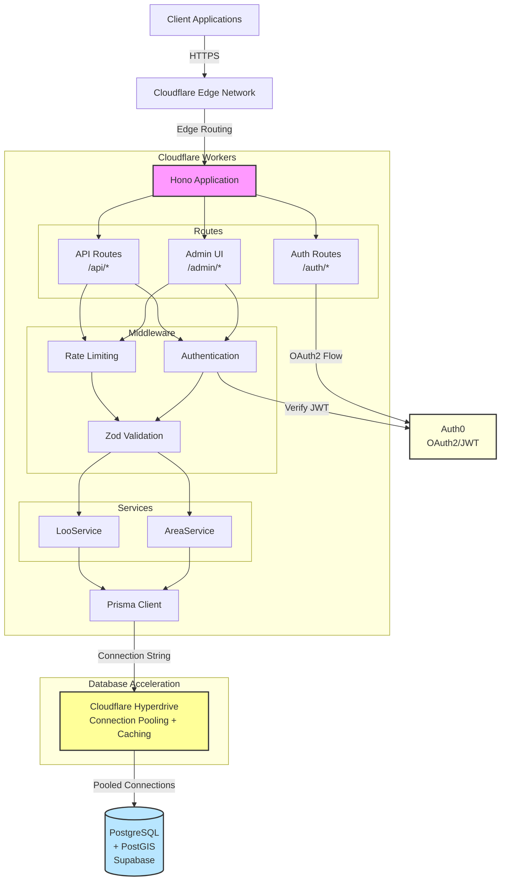

# Architecture Overview

toiletmap-server is a serverless API built on Cloudflare Workers that provides public access to UK toilet location data.

## System Architecture



## Technology Stack

### Runtime & Framework

- **Cloudflare Workers**: V8 isolates running on 300+ edge locations
- **Hono**: Lightweight, edge-optimized web framework
- **TypeScript**: Type-safe development with strict mode

### Data Layer

- **PostgreSQL 15+**: Primary database with ACID compliance
- **PostGIS**: Spatial/geographic queries for proximity search
- **Cloudflare Hyperdrive**: Database acceleration service providing:
  - Edge connection setup (reducing 7 round trips to 1)
  - Connection pooling near the database (optimal placement)
  - Query caching for read operations (60s default TTL)
  - See [hyperdrive.md](./hyperdrive.md) for detailed explanation
- **Prisma 7+**: Type-safe ORM with Cloudflare adapter
- **Supabase**: Managed PostgreSQL hosting (or self-hosted)

### Authentication

- **Auth0**: OAuth2/OIDC provider
- **RS256 JWT**: Stateless authentication tokens
- **JWKS**: Public key verification

### Validation & Testing

- **Zod**: Runtime schema validation with TypeScript inference
- **Vitest**: Fast unit and integration testing
- **@hono/zod-validator**: Middleware for request validation

## Key Design Principles

### 1. Edge-First Architecture

The application runs on Cloudflare's edge network, serving requests from the location nearest to users:

- **Global Distribution**: 300+ data centers worldwide
- **Low Latency**: Avg <50ms response time for cached endpoints
- **Auto-scaling**: Handles traffic spikes without configuration
- **Zero Cold Starts**: V8 isolates start in <1ms

### 2. Serverless & Stateless

Workers are stateless and ephemeral:

- **No Local State**: All state in PostgreSQL or Auth0
- **Idempotent Operations**: Safe to retry requests
- **Immutable Deployments**: Each deploy creates a new version
- **Automatic Failover**: Cloudflare routes around failures

### 3. Type Safety End-to-End

TypeScript provides compile-time guarantees:

- **Prisma Schema**: Database types generated from schema
- **Zod Schemas**: Runtime validation with inferred types
- **Service Layer**: Business logic with explicit types
- **No `any`**: Strict TypeScript mode enforced

### 4. Layered Architecture

Clear separation of concerns:

```
Routes → Middleware → Services → Prisma → Database
```

- **Routes**: HTTP handling, request/response formatting
- **Middleware**: Cross-cutting concerns (auth, rate limiting, validation)
- **Services**: Business logic and data transformation
- **Prisma**: Data access and query building
- **Database**: Data persistence and spatial operations

## Data Flow

### Read Operation (GET /api/loos/proximity)

```
1. Client → GET /api/loos/proximity?lat=51.5&lng=-0.1&radius=1000
2. Cloudflare Edge → Route to nearest Worker
3. Rate Limiter → Check if request allowed (100 req/min)
4. Validator → Parse and validate query parameters
5. LooService → Build spatial query with PostGIS
6. Prisma → Connect via Hyperdrive binding (fast edge setup)
7. Hyperdrive → Check query cache or use pooled connection
8. Database → Return matching rows (if not cached)
9. Hyperdrive → Cache response (if cacheable query)
10. Service → Transform to DTOs, add distance calculations
11. Worker → Respond with JSON: {data: [...], count: N}
```

### Write Operation (POST /api/loos)

```
1. Client → POST /api/loos with JWT in Authorization header
2. Cloudflare Edge → Route to nearest Worker
3. Rate Limiter → Check write limit (20 req/min per user)
4. Auth Middleware → Verify JWT with Auth0 JWKS
5. Validator → Validate request body against createMutationSchema
6. LooService → Generate loo ID, extract contributor from JWT
7. Prisma → Connect via Hyperdrive binding
8. Hyperdrive → Use pooled connection (writes are never cached)
9. Database → Persist new loo, return created row
10. Service → Return loo DTO
11. Worker → Respond with 201 Created
```

## Deployment Architecture

### Production

```
┌─────────────────────────────────────────┐
│      Cloudflare Dashboard/API           │
│                                          │
│  Wrangler CLI → Deploy Worker Bundle    │
└─────────────────┬───────────────────────┘
                  │
    ┌─────────────▼─────────────────┐
    │   Cloudflare Workers Global   │
    │   (300+ Edge Locations)       │
    └─────────────┬─────────────────┘
                  │
    ┌─────────────▼─────────────────┐
    │   Supabase PostgreSQL         │
    │   (Primary: eu-west-1)        │
    └───────────────────────────────┘
```

### Development

```text
┌────────────────┐
│  Local Machine │
│                │
│  ┌──────────┐  │      ┌──────────────┐
│  │ miniflare│  │◄────►│ Test Auth    │
│  └────┬─────┘  │      │ Server       │
│       │        │      │ (Port 44555) │
│       │        │      └──────────────┘
│  ┌────▼─────┐  │
│  │PostgreSQL│  │
│  │+ PostGIS │  │
│  └──────────┘  │
└────────────────┘
```

**Key Difference**:

- **Production**: Uses `HYPERDRIVE` binding to connect to remote Supabase via Cloudflare's global network.
- **Development**: Uses `TEST_HYPERDRIVE` binding to connect directly to the local Docker database.

## Scalability & Performance

### Database Connection Management

Cloudflare Hyperdrive manages database connections automatically:

- **Connection Pooling**: Hyperdrive maintains a pool of connections near the database
- **Pool Placement**: Connections are placed in regions closest to the origin database
- **Connection Reuse**: Pre-existing connections are reused across Worker invocations
- **Automatic Scaling**: Pool size scales automatically based on traffic (soft limits)
- **Query Timeout**: 30s max query execution
- **Transaction Pooling**: Connections are held for the duration of a transaction

See [hyperdrive.md](./hyperdrive.md) for comprehensive details on connection lifecycle and pooling behavior.

### Caching Strategy

- **Static Assets**: Cached at edge with long TTL
- **API Responses**: No caching (always fresh data)
- **JWKS Keys**: Cached for 1 hour, refreshed on miss

### Rate Limiting

See [../operations/rate-limiting.md](../operations/rate-limiting.md) for detailed rate limiting architecture.

## Security

### Authentication Flow

See [request-flow.md](./request-flow.md#authentication-flow) for detailed authentication sequence diagrams.

### Data Security

- **Encryption in Transit**: TLS 1.3 for all connections
- **Encryption at Rest**: Database encryption via Supabase
- **Secrets Management**: Environment variables in Cloudflare dashboard
- **JWT Verification**: RS256 with rotating public keys (JWKS)

### Input Validation

All user input validated with Zod schemas:

- **Type Coercion**: Automatic string→number conversion
- **Range Validation**: Lat/lng bounds, string lengths
- **Sanitization**: Trimming, normalization
- **Error Messages**: Descriptive validation failures

## Monitoring & Observability

### Logging

Structured JSON logs with contextual metadata:

```typescript
logger.info("Request completed", {
  requestId,
  method,
  path,
  status,
  duration,
  userId,
});
```

### Metrics

Available in Cloudflare Workers Analytics:

- Request count by status code
- CPU time per request
- Invocation duration (p50, p95, p99)
- Error rate

### Alerting

Configure Cloudflare Workers alerts for:

- Error rate > 1%
- CPU time > 50ms (p95)
- Request failures

## See Also

- [Hyperdrive](./hyperdrive.md) - Comprehensive guide to Cloudflare Hyperdrive
- [Request Flow](./request-flow.md) - Detailed sequence diagrams
- [Authentication](../authentication/overview.md) - Auth flow and JWT handling
- [Rate Limiting](../operations/rate-limiting.md) - Rate limiting strategy
