# Request Flow

This document provides detailed sequence diagrams for common request patterns in toiletmap-server.

## Public API Read Request

Flow for unauthenticated public API requests (e.g., `GET /api/loos/proximity`):

## Authenticated Write Request

Flow for authenticated write requests (e.g., `POST /api/loos`):

## Authentication Flow

OAuth2 authorization code flow for admin login:

### OAuth Hardening (state + nonce)

Standard OAuth2 flows allow users to log in, but without extra protections, they are vulnerable to specific types of interception attacks. To secure the `/admin` login, we implement the **State** and **Nonce** patterns.

Think of this system like a **Coat Check** at a venue:

1.  **State:** You get a unique ticket. If you lose it, you can't get your coat back (and no one else can claim it).
2.  **Nonce:** The ticket is stamped with today's date. Someone cannot use a ticket they stole from you last week.

We implement these checks using short-lived, secure cookies.

#### 1. The `state` Parameter (Stopping CSRF)

- **The Threat (CSRF):** A **Cross-Site Request Forgery** attack happens when a malicious website tricks a user's browser into sending a request to our server. In an OAuth context, an attacker could trick a user into logging into the _attacker's_ account, allowing the attacker to track the user's activity.
- **The Defense:**
  1.  When the user starts a login, we generate a random string (the `state`).
  2.  We save this in a secure, HTTP-only cookie (`auth_state`).
  3.  We send the same string to Auth0.
  4.  When Auth0 redirects the user back to us, they must bring that `state` back.
  5.  **The Check:** We compare the `state` from Auth0 with the `state` in the cookie. If they don't match, the login request did not originate from us, and we block it.

> **Note on Timing Attacks:** We use _constant-time comparison_ logic to check the state. This ensures that the server takes the exact same amount of time to reject a wrong code, whether the first letter is wrong or the last letter is wrong. This prevents hackers from guessing the code by measuring how long the server takes to respond.

#### 2. The `nonce` Parameter (Stopping Replay Attacks)

- **The Threat (Replay Attack):** If a hacker intercepts the ID Token sent by Auth0 (e.g., over an insecure Wi-Fi), they could try to send that token to our server later to impersonate the user.
- **The Defense:**
  1.  We generate a cryptographically random string (the `nonce`) alongside the state.
  2.  We save this in a cookie (`auth_nonce`) and send it to Auth0.
  3.  Auth0 embeds this `nonce` inside the signed ID Token it generates.
  4.  **The Check:** When the token arrives, we decode it and verify that the `nonce` inside the token matches the one in our cookie.
  5.  Once used, the cookie is destroyed immediately. This ensures the token is "fresh" and hasn't been captured and replayed.

#### 3. Hardening Diagram

This flow illustrates exactly what happens inside the `GET /auth/callback` handler:

```mermaid
flowchart TD
    Start([Callback Received]) --> Cookies{Read Cookies:<br/>auth_state<br/>auth_nonce}

    Cookies -->|Missing?| Block1[🛑 Block: Session Expired/Invalid]
    Cookies -->|Present| Param{Read URL Param:<br/>state}

    Param --> MatchState{Compare:<br/>Cookie State == URL State}
    MatchState -->|No Match| Block2[🛑 Block: CSRF Attempt]
    MatchState -->|Match| Decode[Decode ID Token from Auth0]

    Decode --> MatchNonce{Compare:<br/>Cookie Nonce == Token Nonce}
    MatchNonce -->|No Match| Block3[🛑 Block: Replay Attack]

    MatchNonce -->|Match| Success[✅ Login Successful]

    Success --> Cleanup[Clear Auth Cookies]
    Block1 --> Cleanup
    Block2 --> Cleanup
    Block3 --> Cleanup

    Cleanup --> Finish([End])

    style Block1 fill:#ff6b6b,color:white
    style Block2 fill:#ff6b6b,color:white
    style Block3 fill:#ff6b6b,color:white
    style Success fill:#51cf66,color:white
```

### Auth0 `/userinfo` caching

Workers keep a small in‑memory cache (2‑minute TTL, keyed by a SHA‑256 digest of the access token) for Auth0 `/userinfo` responses. Although isolates are ephemeral, this cache significantly reduces repeated upstream calls during bursts (e.g., multiple admin requests in a short window) and limits the blast radius if Auth0 temporarily rate limits us. If an isolate is recycled the cache naturally evaporates with no persistence.

### Rate limiting fallback rationale

Primary throttling is enforced via Cloudflare’s Rate Limiting API bindings. Each middleware instance also ships with a like‑for‑like in‑memory fallback so that:

- Local development and CI (where bindings are unavailable) still exercise realistic budgets.
- Production gracefully degrades if a binding is misconfigured instead of failing wide open.

The fallback uses the same key derivation (IP or user) and limit window but only protects a single isolate; Cloudflare’s edge limits remain the authoritative protection in production.

## Proximity Search Flow

Detailed flow for geospatial proximity search:

## Admin Page Render Flow

Server-side rendering flow for admin pages:

## Error Handling Flow

How errors are handled and logged:

## Rate Limiting Decision Flow

How rate limiting decisions are made:

## Performance Characteristics

### Typical Response Times

| Endpoint Type                   | p50   | p95   | p99   |
| ------------------------------- | ----- | ----- | ----- |
| Simple read (GET /api/loos/:id) | 15ms  | 35ms  | 80ms  |
| Proximity search                | 45ms  | 120ms | 250ms |
| Full-text search                | 80ms  | 200ms | 400ms |
| Write operation                 | 60ms  | 150ms | 300ms |
| Admin page render               | 100ms | 250ms | 500ms |

### Bottlenecks

- **Database queries**: PostGIS spatial operations can be expensive
- **JWKS fetching**: First JWT verification requires Auth0 request
- **Connection pool**: Hyperdrive manages connection pooling automatically

### Optimization Strategies

- **Spatial indexes**: GIST indexes on `location` column
- **Connection pooling**: Hyperdrive connection pooling for efficient database access
- **Query caching**: Hyperdrive automatic caching for read queries (60s TTL)
- **Query optimization**: `EXPLAIN ANALYZE` for slow queries
- **JWKS caching**: JWKS keys cached for 1 hour

## See Also

- [Architecture Overview](./overview.md) - System architecture
- [Hyperdrive](./hyperdrive.md) - Database acceleration with Hyperdrive
- [Authentication](../authentication/overview.md) - Auth details
- [Rate Limiting](../operations/rate-limiting.md) - Rate limiting configuration
